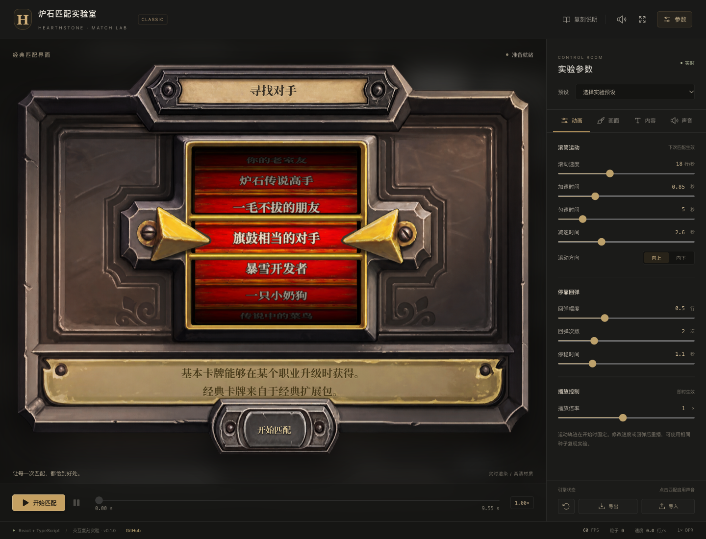

# 炉石匹配实验室 · Hearthstone Match Lab

可调参数的炉石匹配界面复刻，观察滚筒减速、指针抖动、粒子和合成音效。

An adjustable React matchmaking recreation with spinner motion, sparks and synthesized audio.

[在线体验](https://hearthstone-match.xiaosang.cc/) · [源码](https://github.com/holynova/hearthstone-match)



## 可以做什么

- 调整名单、结果、时序、画面与混音。
- 导入导出配置，并通过时间轴观察匹配动画。

## 开始一次匹配

点击「开始匹配」，在右侧面板调整滚筒速度、回弹、粒子或名单；用暂停和时间轴逐帧观察。修改运动参数后重新开始匹配。

## 本地运行

```bash
npm ci
npm run dev
npm run build
```

组件与交互逻辑在 `src/`，已有验证可通过 `npm test` 与 `npm run test:sites` 运行。

这是非官方界面复刻，不连接真实匹配服务；默认音效由Web Audio合成。


## 发布

```bash
npm run deploy
```

从 `main` 同一提交在本地手动发布到Cloudflare Workers。正式地址：[https://hearthstone-match.xiaosang.cc/](https://hearthstone-match.xiaosang.cc/)。
