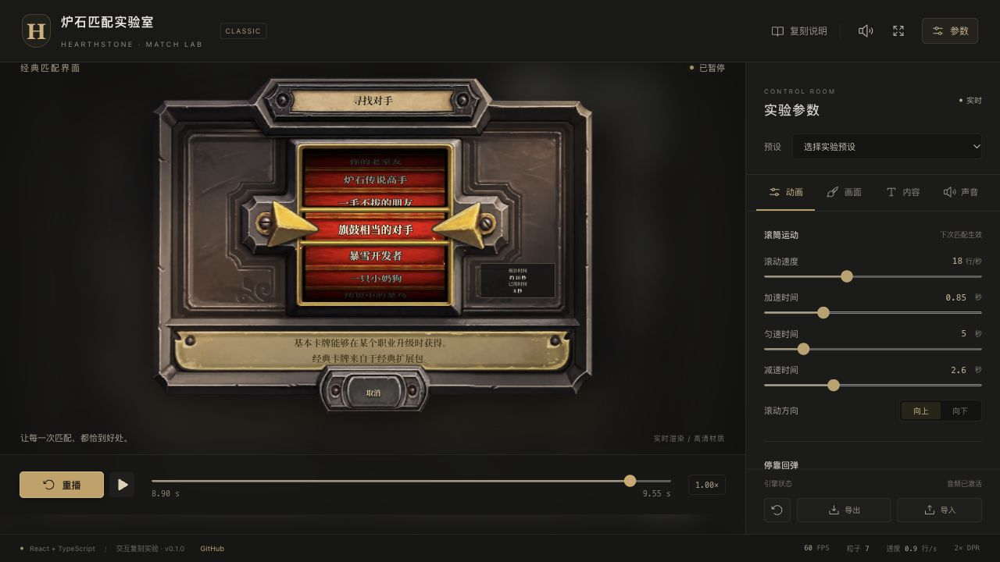

# 炉石匹配实验室 / Hearthstone Match Lab

中文：经典炉石传说匹配界面的 React 交互复刻。独立组件支持曲面滚筒、减速回弹、指针抖动、火花粒子及合成音效；实验面板可调整时序、名单、结果与混音，并导入导出配置。非官方界面模拟器，默认声音由 Web Audio 合成。

English: A reusable React recreation of the classic Hearthstone matchmaking screen, with a cylindrical spinner, deceleration and rebound, moving pointers, sparks, synthesized audio, and an adjustable experiment panel. Configure candidates, results, timing, visuals, and audio; import or export settings. An unofficial UI simulator.



## 在线体验 / Live Demo

- [Cloudflare Demo](https://hearthstone-match.xiaosang.cc/)（待验证 / pending verification）
- [GitHub Repo](https://github.com/holynova/hearthstone-match)


## 本地运行 / Run locally

Node.js 22.18+; React 19 + TypeScript + Vite.

```bash
npm ci
npm run dev
npm test
npm run build
```

## 发布 / Deploy

```bash
npm run deploy:check
npm run deploy
```

Cloudflare Workers · `hearthstone-match.xiaosang.cc` · v0.1.0

源码与部署配置在 main 维护，本地手动部署。Source and deployment configuration share main; deploy manually from the same commit.

[组件 API / Component API](docs/component-api.md) · [参考来源 / References](references/sources.md)
